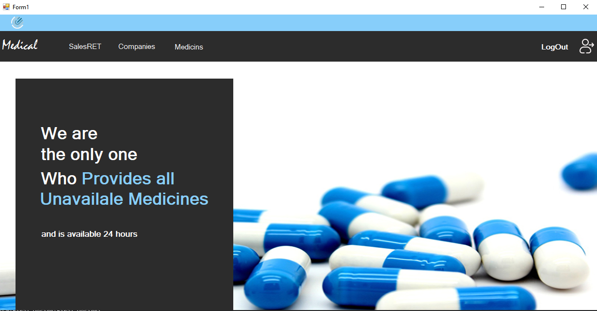
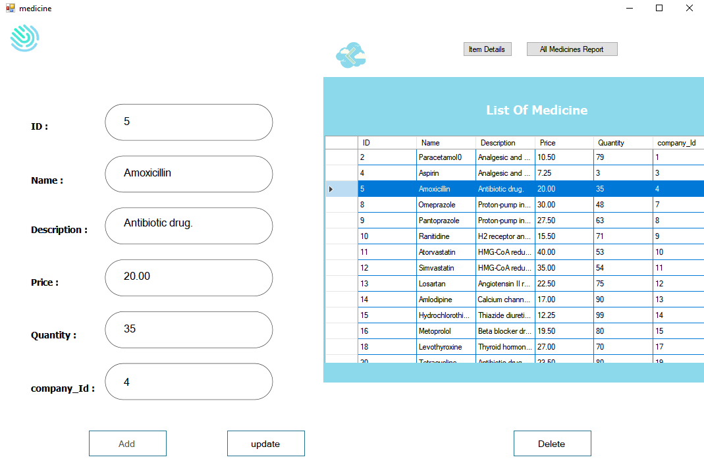
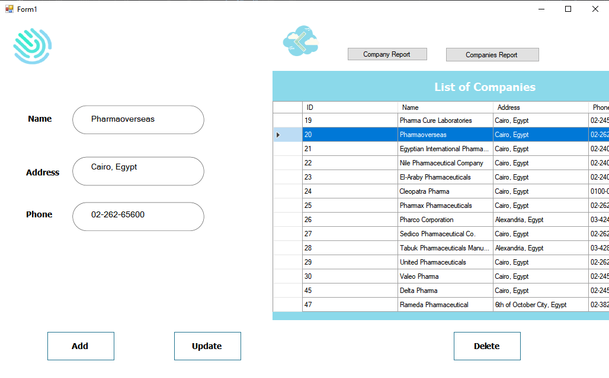
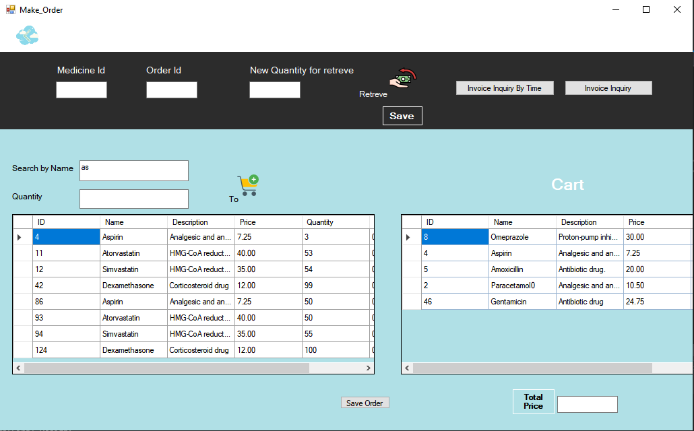
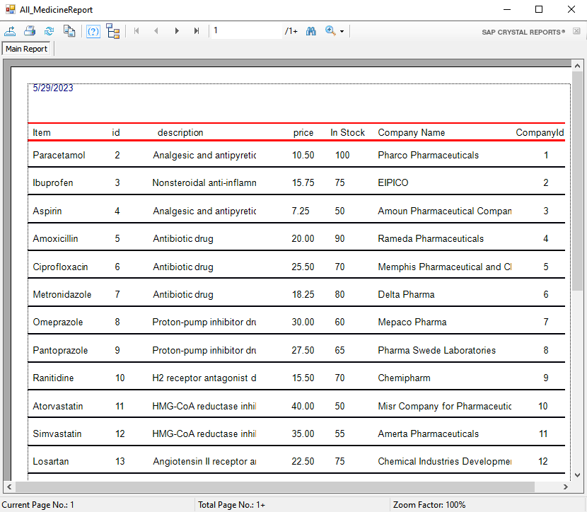
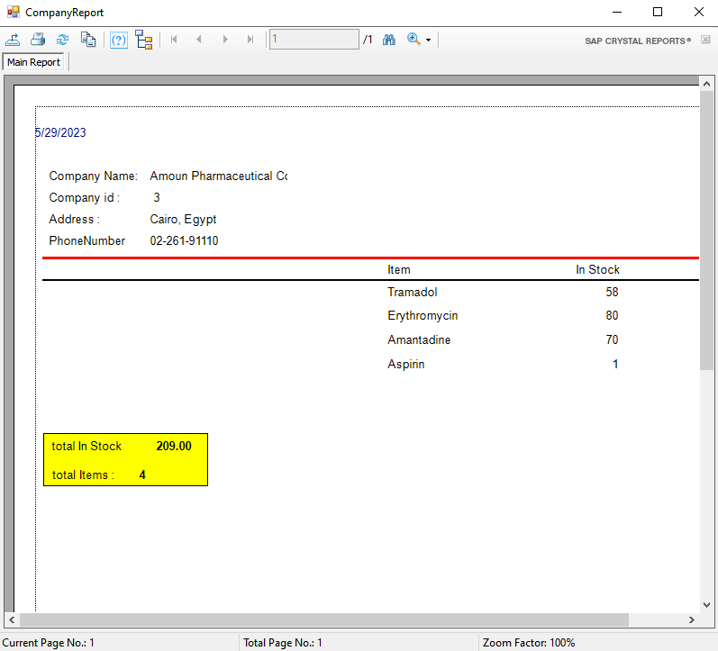
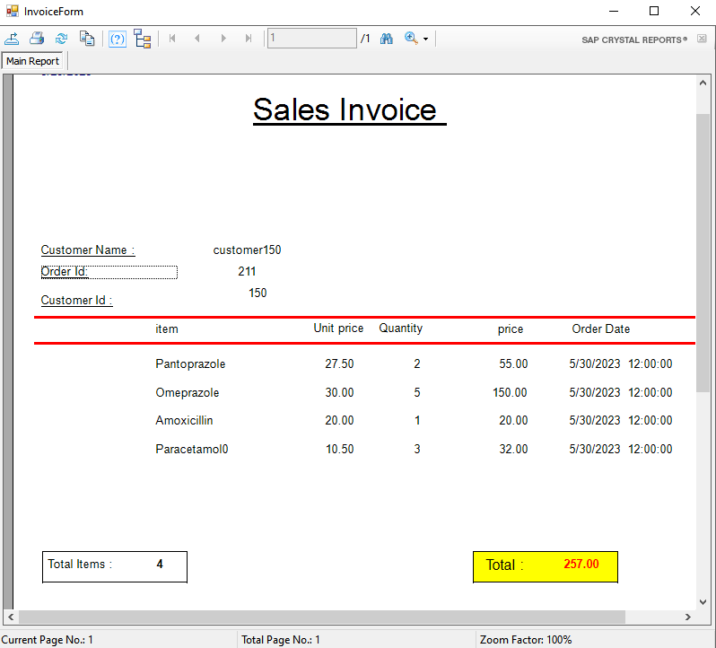
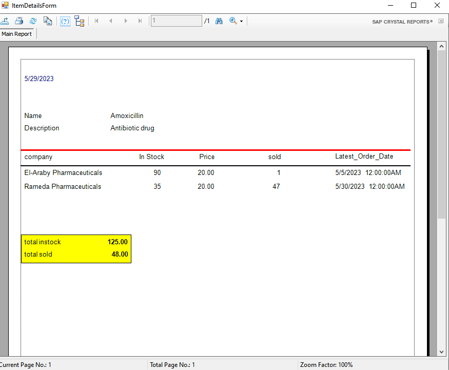

## Medicine Store Desktop App

The **Medicine Store Desktop App** is a software application designed to simplify the management of a medicine store. This application is aimed at assisting store owners and employees in efficiently handling inventory, sales, and purchases of medicines. With this app, users can effortlessly monitor stock levels, access detailed sales reports, and manage customer information.

### Key Features

- **Intuitive User Interface:** The app offers an intuitive user interface that simplifies various tasks, including:

- Home

  - - 
  
  
  - Adding, editing, and deleting medicines
    
  - - 

  - Managing medicine company information (adding, editing, and deleting)
    
   - 
  
  - Handling sales (adding new sales and editing existing sales)
    
   - 

- **Comprehensive Reporting:** The app provides comprehensive reports with images:
  
  - 
    
  - 
    
  - 
 
  - 
    

By using this app, users gain insights into their store's operations, enabling them to promptly address areas that require attention.
